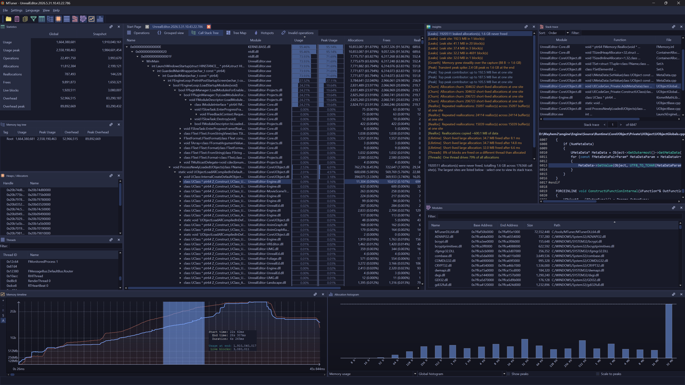
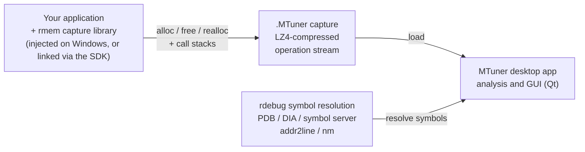

<div align="center">


**A C/C++ memory profiler and leak finder with a complete, time‑based history of every allocation.**

[](https://ci.appveyor.com/project/milostosic/mtuner)
[](https://github.com/RudjiGames/MTuner/blob/master/LICENSE)
[](#supported-platforms)

</div>

**MTuner** uses a novel approach to memory profiling: instead of sampling or keeping only a live snapshot, it records the **entire time‑based history** of memory operations. Every allocation, reallocation and free — together with its call stack, thread, heap and timestamp — is captured, so you can scrub through time and run queries over the *whole* data set rather than a single moment.

That history is what makes MTuner different from a typical "live heap" profiler: leaks, peaks, fragmentation, churn and short‑lived spikes are all visible after the fact, for any point or range in your program's run.

> **New in v5:** an **Insights** tab that automatically analyzes a capture and surfaces ranked, explainable recommendations — leaks, churn, repeated reallocations, peak spikes, cross‑thread frees and more — each linking straight to the relevant stack trace and timeline. Plus faster, lighter loading of large captures and several new themes. See [What's new in version 5](#whats-new-in-version-5).



---

## Table of Contents

- [Features](#features)
- [What's new in version 5](#whats-new-in-version-5)
- [Supported platforms](#supported-platforms)
- [How it works](#how-it-works)
- [Getting MTuner](#getting-mtuner)
- [Profiling your application](#profiling-your-application)
- [Building from source](#building-from-source)
- [Documentation](#documentation)
- [License](#license)

---

## Features

- **Full timeline of memory operations** — replay and inspect the heap at any point in time, not just at the end.
- **Memory leak detection** — every block that is allocated but never freed is reported, with the call stack that allocated it.
- **Automatic insights** — MTuner analyzes the whole capture and lists ranked, explainable recommendations: leaks, allocation churn, repeated buffer reallocations, short‑lived large allocations, cross‑thread frees, transient peak spikes, allocator overhead, tag coverage and more. Each finding links straight to the offending call stack and point on the timeline — no machine learning, just deterministic rules over the complete history.
- **Rich visualizations** — memory usage timeline/histogram, call‑stack tree, tree map, and memory hotspots.
- **Drill‑down by everything** — group and filter operations by call stack, module, allocator/heap, thread, tag and size.
- **Tags & markers** — annotate the timeline with named scopes and events to correlate memory behavior with what your app was doing.
- **Low‑overhead capture** — a tiny capture library records operations and writes **LZ4‑compressed** captures on a background thread to keep the profiled app responsive.
- **Symbol resolution that just works** — PDBs via DIA and the **Microsoft public symbol server** on Windows, and `addr2line`/`nm` for GCC and PlayStation toolchains.
- **Built for large captures** — compact (48‑byte) operation records in VM‑backed arenas plus multi‑threaded analysis keep multi‑million‑operation captures fast to load and light on memory.
- **Themes & localization** — multiple dark and light themes (MTuner Dark, Monokai, Shanghai Night, Bright Owl, Wise Green) with fully theme‑aware graphs, tree map and histogram, plus a translatable UI.
- **Profile almost anything** — designed for C/C++, but any language works as long as matching debug symbols are available. (DMD CodeView/DWARF symbols can be converted to PDB with [cv2pdb](https://github.com/rainers/cv2pdb).)

## What's new in version 5

- **Insights tab** — a new dock that scans the loaded capture and surfaces ranked, actionable findings. The analysis is rule‑based and deterministic (and runs over already‑computed aggregates, so it's instant). Categories include:
  - **Leaks** — total leaked memory and the largest leak sites.
  - **Growth / Peak** — steady upward memory trends, and transient peak spikes where the high‑water mark is far above the final usage.
  - **Churn & reallocations** — call sites that allocate huge numbers of short‑lived blocks, and buffers reallocated over and over (reserve‑capacity candidates).
  - **Lifetime** — large allocations that are freed almost immediately (scratch/stack candidates).
  - **Threads** — blocks freed on a different thread than they were allocated on (allocator contention), and threads that dominate allocation traffic.
  - **Allocator / tags** — bookkeeping overhead, a dominant heap, small‑allocation pressure, over‑alignment waste, and memory‑tag coverage.
  - Selecting a finding jumps straight to its stack trace and the relevant point on the timeline.
- **Faster, lighter loading** — memory operations are stored as compact 48‑byte records in virtual‑memory‑backed arenas, and the post‑load analysis (groups, stack‑trace/tag trees, stats) is parallelized, so large captures open quicker and use significantly less RAM.
- **Reworked appearance** — five built‑in themes (MTuner Dark, Monokai, Shanghai Night, Bright Owl, Wise Green) with theme‑aware custom‑painted views (timeline, tree map, histogram) and syntax highlighting that stays readable on light and dark backgrounds.
- **Hardening** — an extensive pass over the capture engine, symbol resolution and loader fixing buffer‑overflow, race and lifetime issues across the codebase.

## Supported platforms

The MTuner **application** — where you open and analyze captures — currently runs on **Windows**. Linux and macOS builds compile but are **not yet functional** (work in progress).

You **capture** from your application on one of the targets below, then analyze the result on Windows. Captures are portable, so you profile on the target and analyze on your desktop.

| Capture target | How |
|---|---|
| **Windows** | inject into a process, or link the SDK |
| **PlayStation 3 / 4 / 5** | link the SDK |
| **Nintendo Switch** | link the SDK |
| **Android** | link the SDK |

> The capture library also has Linux/macOS support, but the desktop application that reads captures is Windows‑only for now.

## How it works



- **rmem** is the capture library. It hooks your allocator (injected into a process on Windows, or linked in via the SDK), records each operation with its stack trace, and streams an LZ4‑compressed capture to disk.
- The **`.MTuner`** capture file is the complete, replayable operation history.
- **rdebug** resolves stack addresses to functions/files/lines — downloading PDBs from the symbol server when needed.
- **MTuner** is the Qt desktop application that loads the capture and provides the timeline, trees, maps and queries.

## Getting MTuner

### Download a release

Pre‑built binaries are available on the [releases](https://github.com/RudjiGames/MTuner/releases) page.

> **Note:** if your application crashes while being profiled, try adding the **MTuner** folder to the *Exclusions* list under *Virus & threat protection settings* — some AV products interfere with the injected capture library.

### Clone the source

```sh
git clone https://github.com/RudjiGames/MTuner.git
cd MTuner
git submodule update --init --recursive
```

## Profiling your application

There are two ways to capture:

1. **Launch / inject (Windows)** — point MTuner at an executable and it injects the capture library; no changes to your build required.
2. **Integrate the SDK** — link the small **rmem** library into your application for cross‑platform capture (including consoles and Android). See the `linker` and `manual` samples in the SDK.

Either way, the result is a `.MTuner` capture file that you open in the desktop application to analyze.

## Building from source

**MTuner** uses the [**Qt**](https://www.qt.io/) framework for its user interface, so Qt must be installed on the build machine. The build system is based on [**GENie**](https://github.com/bkaradzic/GENie) and [**zidar**](https://github.com/RudjiGames/zidar), which dramatically simplify managing build configurations and dependencies.

> Building Qt‑based projects with **zidar** requires **Lua** to be installed.

After cloning the repository and its submodules:

### Visual Studio

```bat
> cd src/MTuner/scripts
> genie vs2022
```

The solution is generated at `.zidar/windows/vs2022/MTuner/projects/vs2022/MTuner.sln` (relative to the repository root).

### MinGW

```sh
$ cd src/MTuner/scripts
$ genie --gcc=mingw-gcc gmake
$ cd ../../../.zidar/windows/mingw-gcc/MTuner/projects/
$ make
```

The `MINGW` environment variable must be set and point to the MinGW installation directory. Tested with [TDM64 MinGW](http://tdm-gcc.tdragon.net/download) using the [OpenMP package](http://sourceforge.net/projects/tdm-gcc/files/TDM-GCC%205%20series/5.1.0-tdm64-1/gcc-5.1.0-tdm64-1-openmp.zip/download).

### Locating Qt

Environment variables tell the build where Qt lives, for example:

```bat
set QTDIR_VS2022_x86=C:\<some_path>\Qt\6.9.3\msvc2022_64
set QTDIR_VS2022_x64=C:\<some_path>\Qt\6.9.3\msvc2022_64
```

> Qt deprecated 32‑bit builds, which is why both variables point to the same (64‑bit) location.

## Documentation

Full documentation is available at **[RudjiGames.github.io/MTuner](https://RudjiGames.github.io/MTuner/)**.

## License

MTuner is released under the **BSD 2‑clause** license.

<a href="http://opensource.org/licenses/BSD-2-Clause" target="_blank">

</a>

```
Copyright 2023 Milos Tosic. All rights reserved.

https://github.com/RudjiGames/MTuner

Redistribution and use in source and binary forms, with or without
modification, are permitted provided that the following conditions are met:

   1. Redistributions of source code must retain the above copyright notice,
      this list of conditions and the following disclaimer.

   2. Redistributions in binary form must reproduce the above copyright
      notice, this list of conditions and the following disclaimer in the
      documentation and/or other materials provided with the distribution.

THIS SOFTWARE IS PROVIDED BY COPYRIGHT HOLDER ``AS IS'' AND ANY EXPRESS OR
IMPLIED WARRANTIES, INCLUDING, BUT NOT LIMITED TO, THE IMPLIED WARRANTIES OF
MERCHANTABILITY AND FITNESS FOR A PARTICULAR PURPOSE ARE DISCLAIMED. IN NO
EVENT SHALL COPYRIGHT HOLDER OR CONTRIBUTORS BE LIABLE FOR ANY DIRECT,
INDIRECT, INCIDENTAL, SPECIAL, EXEMPLARY, OR CONSEQUENTIAL DAMAGES
(INCLUDING, BUT NOT LIMITED TO, PROCUREMENT OF SUBSTITUTE GOODS OR SERVICES;
LOSS OF USE, DATA, OR PROFITS; OR BUSINESS INTERRUPTION) HOWEVER CAUSED AND
ON ANY THEORY OF LIABILITY, WHETHER IN CONTRACT, STRICT LIABILITY, OR TORT
(INCLUDING NEGLIGENCE OR OTHERWISE) ARISING IN ANY WAY OUT OF THE USE OF
THIS SOFTWARE, EVEN IF ADVISED OF THE POSSIBILITY OF SUCH DAMAGE.
```
